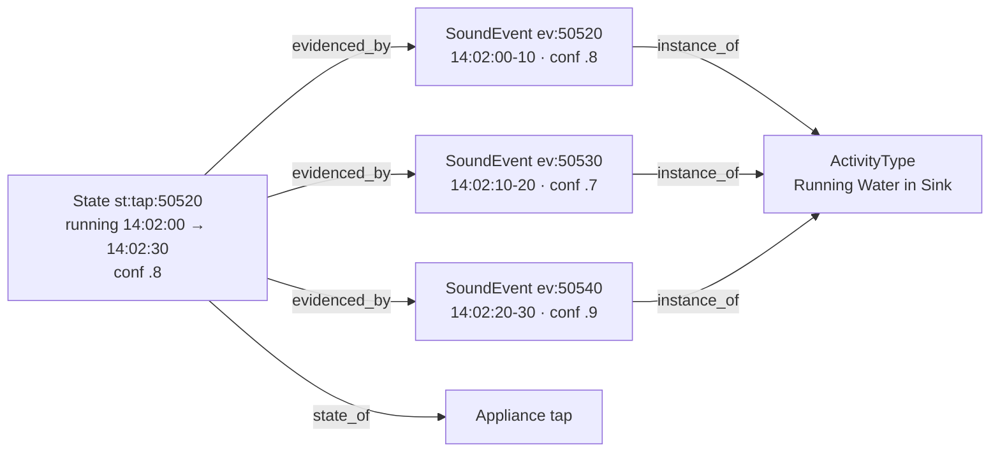

# Graph schema v1 (provided — read, verify, extend only with sign-off)

The graph is a `networkx.MultiDiGraph`. Two kinds of nodes: **entity nodes** (one per
thing/type, no timestamps) and **instance nodes** (one per occurrence, timestamped).
Nothing is ever deleted or overwritten — history *is* the product.

## Node types

| Type | One per… | id example | attributes |
|---|---|---|---|
| `Appliance` | appliance/object type | `washing_machine` | `label` |
| `ActivityType` | activity category | `act:Running Water in Sink` | `label` |
| `SoundEvent` | caption record (instance) | `ev:43200` | `t_start, t_end, description, confidence, clip_file` |
| `State` | continuous state interval (instance) | `st:washing_machine:41000` | `state` ("running"), `t_start`, `t_end` (`None` while open), `confidence` |

`Room` is deferred — the data has no room info yet. Add it only when it does.

## Edge types

| Edge | From → To | Meaning |
|---|---|---|
| `instance_of` | SoundEvent → ActivityType | this 10s clip was this kind of activity |
| `state_of` | State → Appliance | this interval describes this appliance |
| `evidenced_by` | State → SoundEvent | provenance: the records this state was inferred from |

Temporal order ("what came before X") is **derived from timestamps at query time**, not
stored as edges — storing `before` edges for 5,400 events/day would be noise.

## Attributes rules

- Every instance node carries `confidence` in [0,1]. A State's confidence = mean of its
  evidence records' confidences.
- Every State must have ≥1 `evidenced_by` edge. No orphan inferences, ever — an answer
  we can't trace to a clip is an answer we can't defend.
- `t_end=None` means "still open as far as the audio shows" — that's information, not
  a bug (it's how "did I turn it off?" gets answered).

## Worked example

Five records: tap runs 14:02:00–14:02:30 (3 records, confidences .8/.7/.9), then two
quiet records. The graph after ingestion:

The two quiet records close the interval (see METHODS.md, M1): `t_end = 14:02:30`.
Query `history("tap")` → `[{state: running, 14:02:00–14:02:30, conf 0.8, evidence: 3 clips}]`.
Question *"Did I turn the tap off?"* → the interval is **closed** → *"Yes — the water
sound stopped at 14:02:30 (confidence 0.8, 3 clips)."* If the quiet records were missing,
the interval would be open → *"I last heard it running at 14:02:30 and no stop since —
it may still be on."*

## Appliance vs. Activity — the mapping

Some activities imply an appliance state (`Running Water in Sink` → tap running,
`Washing Machine` → washing_machine running); some don't (`Chopping Board` is an
activity only). Keep a small dict `ACTIVITY_TO_APPLIANCE` in `graph/build.py` — that
dict is the only place this knowledge lives.
